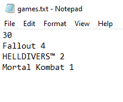
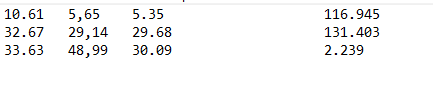

<div align="center">

# Price Researcher

**Automated game price & popularity intelligence for resellers**

[](https://github.com/JoaoVitor2310/price-researcher/actions/workflows/ci.yml)


> **Personal project** built for real production use at **CarcaDeals**, a game key reseller.<br/>
> Replaced a fully manual process, cutting research time from hours to minutes.

</div>

---

## The Problem

A supplier sends a list of 200+ game titles with asking prices. The buyer needs to cross-reference each game against marketplaces to decide what's worth purchasing — a process that previously took **hours of manual copy-pasting** across multiple sites.

## The Solution

Price Researcher fully automates that workflow:

1. Accepts a plain `.txt` file (one game per line + a minimum popularity threshold)
2. Fetches the **24h peak player count** from SteamCharts for each game
3. Filters out unpopular games (low demand = hard to resell)
4. Scrapes **AllKeyShop** for the best current price on each qualifying game
5. Returns a `.txt` file pre-formatted to paste directly into the buyer's spreadsheet

A second async flow accepts a **Steam ID**, crawls the user's trade lists on SteamTrades, extracts game names, and runs the same analysis pipeline — fully hands-off.

---

## Business Impact

| Before | After |
|---|---|
| 2–4 hours of manual research per list | ~5 minutes end-to-end |
| Human error in copy-pasting prices | Zero manual steps |
| No popularity signal → bad purchases | Games pre-filtered by real demand data |
| No SteamTrades integration | Full trade list automation via Steam ID |

---

## Technical Highlights

- **Clean Architecture** — strict `Domain → Application → Infrastructure → Presentation` layering with port/adapter interfaces for every external dependency, enabling full testability without a real browser or network
- **Anti-bot scraping** — Puppeteer Real Browser + stealth plugin to bypass Cloudflare and similar protections on AllKeyShop and SteamTrades
- **Multi-strategy concurrency** — SteamCharts runs in parallel batches of 50; AllKeyShop is strictly sequential (one browser page); SteamTrades uses a serialized promise gate to avoid rate limits
- **Rate limit resilience** — `fetchWithRetry` honours `Retry-After` headers on HTTP 429 with exponential backoff (3 attempts, 5 s base delay); `gotoWithRetry` handles Puppeteer timeouts the same way
- **Async background jobs** — `LimitedConcurrencyScheduler` queues list-processing jobs in-process with configurable concurrency; on completion it POSTs a callback to any URL the caller provides
- **Game name normalisation** — `clear-string.ts` normalises roman numerals, K-suffixed numbers, edition keywords, DLC tags, regional tags and special characters to maximise match accuracy across different naming conventions
- **Full test suite** — 102 tests (unit + integration) with zero real network or browser calls; integration layer tests the full HTTP pipeline via supertest with vitest mocks at the infrastructure boundary
- **CI/CD** — GitHub Actions runs the full test suite on every pull request; merging to `main` is blocked on failure

---

## Stack

| Layer | Technology |
|---|---|
| Runtime | Node.js 22 + TypeScript 5 |
| HTTP Server | Express 5 |
| Validation | Zod 4 |
| Scraping | Puppeteer Real Browser + stealth/adblocker plugins |
| HTTP Client | Axios |
| HTML Parsing | Cheerio |
| File Upload | Multer |
| Testing | Vitest + Supertest |
| Linting | Biome |
| Containerisation | Docker + Xvfb (headless Chromium in Linux) |

---

## Architecture

```
src/
├── routes/            # Thin HTTP routing (method + path only)
├── controllers/       # Request parsing, Zod validation, response shaping
├── schemas/           # Zod schemas + parse helpers
├── application/       # Use cases + port interfaces (dependency inversion)
│   ├── games/         #   SearchGamesUseCase
│   └── lists/         #   RunListsUseCase, EnqueueRunListsUseCase
├── domain/            # Pure domain entities (ListTopic, worthyByPopularity)
├── infrastructure/    # Concrete adapters (SteamCharts, AllKeyShop, SteamTrades)
│   ├── background/    #   LimitedConcurrencyScheduler
│   ├── http/          #   AxiosRunListsCallbackPoster
│   └── lists/         #   FetchListTopic, FormatListResult
├── services/          # Application service orchestration
├── helpers/           # Pure string-transformation utilities (clear-string.ts)
├── lib/               # Shared infrastructure (Puppeteer factory, Disposable)
└── types/             # TypeScript type definitions
```

The `lists` subdomain exposes explicit port interfaces (`ListTopicFetcher`, `BackgroundScheduler`, `RunListsCallbackPoster`, `RunListsRunner`) injected via factory functions — every use case is testable with zero infrastructure.

---

## Getting Started

**Prerequisites:** Node.js ≥ 22, Docker (optional)

```bash
git clone https://github.com/JoaoVitor2310/price-researcher
cd price-researcher
npm install
cp .env.example .env   # fill in your environment variables
npm run dev
```

**With Docker:**
```bash
docker-compose up --build
```

**Run tests:**
```bash
npm test
```

---

## API Endpoints

| Method | Path | Description |
|---|---|---|
| `POST` | `/api/games/search` | Search prices for a JSON list of game names |
| `POST` | `/api/games/upload` | Upload a `.txt` file and receive a formatted result file |
| `POST` | `/api/games/search-id-steam` | Resolve Steam IDs for a list of games |
| `POST` | `/api/lists/run` | Async: crawl a Steam user's trade lists and run full analysis |

<details>
<summary><strong>POST /api/games/upload — input format</strong></summary>

Upload a `text/plain` file via the `fileToUpload` field:

```
100
Half-Life
Portal 2
Hades
```

Line 1 is the **minimum 24h peak player count**. Every subsequent line is a game name.
The response is a `.txt` file ready to paste into a spreadsheet.

</details>

<details>
<summary><strong>POST /api/lists/run — request body</strong></summary>

```json
{
  "id_steam": "76561198000000000",
  "callback_url": "https://your-server.com/callback",
  "checkGamivoOffer": true
}
```

Returns `202 Accepted` immediately. When analysis completes, POSTs to `callback_url`:

```json
{
  "status": "completed",
  "result": "<tab-separated game data>"
}
```

</details>

---

## Input / Output Examples

**Input file**



**Output file** (paste-ready for spreadsheet)



---

<div align="center">

Built by [João Vitor Gouveia](https://www.linkedin.com/in/jo%C3%A3o-vitor-matos-gouveia-14b71437/) · Personal project · Production use at CarcaDeals

</div>
